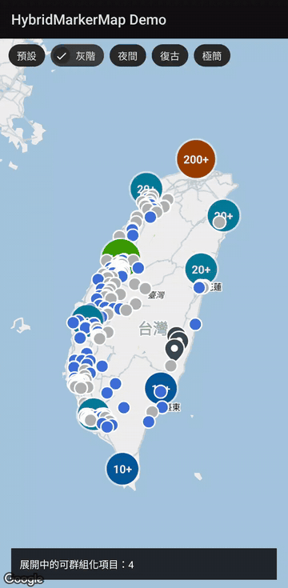

# HybridMarkerMap

[](https://github.com/noel77543/Library_HybridMarkerMap/actions/workflows/ci.yml)

在同一張 Google Map 上同時管理兩種標記的 Android library：

| 類型 | Model | 行為 |
|---|---|---|
| 可群組化 | `ClusterableMarker<T>` | 地圖縮小時相近的項目合併為群組，點擊群組會自動拉近 |
| 不可群組化 | `StandaloneMarker<T>` | 不合併；只繪製可視範圍內的項目並限制數量，移出可視範圍即回收 |

另外內建統一的點擊事件，被選取的 marker 會放大 1.5 倍，再選其他 marker 時自動還原。

<p align="center">
  
</p>

## 專案結構

```
hybridmarkermap/   library module（對外發布的元件）
app/               demo app，以 project(":hybridmarkermap") 引用並實際操作
```

## 安裝

發布於 Maven Central，專案預設的 `mavenCentral()` 即可取得：

```kotlin
// app/build.gradle.kts
dependencies {
    implementation("io.github.noel77543:hybridmarkermap:0.1.0")
}
```

需求：minSdk 23。library 以 `api` 帶入 `play-services-maps` 與 `android-maps-utils`。

授權：[Apache License 2.0](LICENSE)。目前為 0.x 版，API 仍可能變動。

## 使用方式

每個標記只需要 `id`、座標，以及一個你自己的資料物件（payload）。`HybridMarkerMap<C, S>` 的兩個型別參數分別是兩種標記的 payload 型別，icon 與點擊事件中可直接透過 `getPayload()` 取回原本的物件，不需要再用 id 回頭查詢。

```java
// 以你自己的資料類別作為 payload，例如 Store、Station
List<ClusterableMarker<Store>> stores = new ArrayList<>();
for (Store store : storeList) {
    stores.add(new ClusterableMarker<>(store.getId(), store.getLat(), store.getLng(), store));
}
List<StandaloneMarker<Event>> events = new ArrayList<>();
for (Event event : eventList) {
    events.add(new StandaloneMarker<>(event.getId(), event.getLatLng(), event));
}

@Override
public void onMapReady(@NonNull GoogleMap googleMap) {
    HybridMarkerMap<Store, Event> hybridMarkerMap = new HybridMarkerMap<>(context, googleMap);

    // 先設置 icon 與監聽，再放入資料；icon 回傳 null 則使用預設 marker
    hybridMarkerMap.setClusterableIconProvider(item -> getStoreIcon(item.getPayload()));
    hybridMarkerMap.setStandaloneIconProvider(item -> getEventIcon(item.getPayload()));

    // 三種點擊事件都有預設的空實作，只需覆寫需要的
    hybridMarkerMap.setOnMarkerClickListener(new HybridMarkerMap.OnMarkerClickListener<Store, Event>() {
        @Override
        public void onClusterableMarkerClick(@NonNull Marker marker, @NonNull ClusterableMarker<Store> item) {
            showStoreDetail(item.getPayload());
        }

        @Override
        public void onStandaloneMarkerClick(@NonNull Marker marker, @NonNull StandaloneMarker<Event> item) {
            showEventDetail(item.getPayload());
        }
    });
    hybridMarkerMap.setOnUnclusteredItemsChangeListener(items -> { /* 目前被展開的可群組化項目 */ });

    hybridMarkerMap.setMapStyle(MapStyle.GRAYSCALE);
    hybridMarkerMap.setClusterableMarkers(stores);
    // 第二個參數：可視範圍內最多繪製的數量（建議不超過一千）
    hybridMarkerMap.setStandaloneMarkers(events, 300);
}
```

標記物件建立後不可變更。資料更新時，請建立新的標記物件並重新呼叫 `setClusterableMarkers` / `setStandaloneMarkers`：

- 不可群組化標記：`id` 相同的項目會沿用畫面上原本的 marker 與選取狀態，並更新為新的 icon 與座標。
- 可群組化標記：傳入的若仍是同一個物件，會沿用原本的 marker 與選取狀態；換成新物件則重新繪製，並取消選取。

其他方法：

- `setMapStyle(MapStyle)` / `getMapStyle()`：切換地圖樣式，見下方
- `setClusterableIconAnchor(u, v)` / `setStandaloneIconAnchor(u, v)`：設定 icon 對齊座標的錨點，以 icon 的比例表示；預設為 `(0.5, 1)` 底部中央，適合水滴形圖示，圓形圖示可設為 `(0.5, 0.5)`
- `clearSelection()`：取消選取並還原 marker 大小
- `clear()`：移除所有標記
- `getClusterManager()`：取得底層的 `ClusterManager`，用來調整演算法、動畫等進階設定

### 地圖樣式

地圖樣式由 lib 以 `MapStyle` enum 提供：

| 值 | 說明 |
|---|---|
| `DEFAULT` | Google Map 原始樣式（未呼叫 `setMapStyle` 時的狀態） |
| `GRAYSCALE` | 淺灰底、低彩度，突顯標記 |
| `NIGHT` | 深色夜間模式 |
| `RETRO` | 米黃色調的復古風格 |
| `MINIMAL` | 隱藏興趣點、大眾運輸與次要標籤的精簡地圖 |

這些樣式以 JSON 樣式（`MapStyleOptions`）實作，不需要任何 Google Cloud 後台設定。

> **不要與雲端樣式（Map ID）混用。** 如果你的地圖已經透過 Map ID 套用 Google Cloud Console 上設定的雲端樣式（cloud-based maps styling），請不要再呼叫 `setMapStyle`。Google 官方文件明確建議同一個 app 不要同時使用雲端樣式與寫死在程式中的樣式，以免互相衝突。參考：[Add a styled map](https://developers.google.com/maps/documentation/android-sdk/styling)

### 注意事項

- `HybridMarkerMap` 會接管 `GoogleMap` 的 `OnCameraIdleListener` 與 marker 點擊事件；如果需要額外的 camera idle 處理，請不要再呼叫 `googleMap.setOnCameraIdleListener`。
- 除了 `setMapStyle` 以外，元件不會修改地圖外觀（工具列、定位藍點等），這些由使用端自行設定。
- lib 的資源名稱一律以 `hmm_` 開頭，避免與使用端衝突。

## 執行 demo app

1. 在 [Google Cloud Console](https://console.cloud.google.com/google/maps-apis) 取得 Maps SDK for Android 的 API key。
2. 在專案根目錄的 `local.properties` 加入：
   ```
   MAPS_API_KEY=你的key
   ```
3. 執行 `app` module。

demo 資料位於 `app/src/main/assets`，格式為 `{id, name, lat, lng, status}`：

- `sample_clusterable.json`：可群組化項目，`status` 1~4 對應四種顏色
- `sample_standalone.json`：不可群組化項目，`status` 大於 0 視為啟用

畫面上方可以切換五種地圖樣式。

## 測試

| 指令 | 內容 | 執行環境 |
|---|---|---|
| `./gradlew :hybridmarkermap:testDebugUnitTest` | lib 單元測試：可視範圍裁切、地圖樣式 JSON、標記模型 | JVM，不需裝置 |
| `./gradlew :app:connectedDebugAndroidTest` | demo 實機測試：地圖載入、群組計算、樣式切換 | 需連接裝置，並在 `local.properties` 設定 `MAPS_API_KEY` |

每次 push 與 pull request 會由 [GitHub Actions](.github/workflows/ci.yml) 執行單元測試、lint 與建置；實機測試需要裝置與 API key，不在 CI 執行。

## 發布

以 [gradle-maven-publish-plugin](https://github.com/vanniktech/gradle-maven-publish-plugin) 發布至 Maven Central（Sonatype Central Portal）。座標、POM 資訊與版本號設定於 `hybridmarkermap/build.gradle.kts` 的 `mavenPublishing` 區塊。

### 本機測試

不需要任何帳號或金鑰：

```
./gradlew :hybridmarkermap:publishToMavenLocal
```

產出位於 `~/.m2/repository/io/github/noel77543/hybridmarkermap/`。

### 首次發布前的一次性設定

1. 以 GitHub 帳號登入 [Central Portal](https://central.sonatype.com)，會自動取得已驗證的命名空間 `io.github.noel77543`。
2. 在 Central Portal 的 Account 頁面點選 **Generate User Token**，取得 username 與 password。
3. 建立 GPG 金鑰，並將公鑰上傳到 Maven Central 支援的 keyserver（`keyserver.ubuntu.com`、`keys.openpgp.org`、`pgp.mit.edu` 擇一），Maven Central 以此驗證簽章。Git for Windows 已內建 `gpg`，可在 Git Bash 執行：
   ```
   gpg --full-generate-key
   gpg --list-secret-keys --keyid-format=long
   gpg --keyserver keyserver.ubuntu.com --send-keys <完整金鑰ID>
   ```
   金鑰預設有效期為 2 年，到期後以 `gpg --edit-key <金鑰ID>` 的 `expire` 指令延長，並重新上傳。
4. 將私鑰匯出成檔案，放在專案以外的位置：
   ```
   gpg --export-secret-keys -o ~/.gnupg/secring.gpg <完整金鑰ID>
   ```
5. 將帳號與金鑰寫入 **使用者目錄** 的 `~/.gradle/gradle.properties`（不要放進專案，避免 commit）：
   ```
   mavenCentralUsername=<User Token 的 username>
   mavenCentralPassword=<User Token 的 password>
   signing.keyId=<金鑰ID 的最後 8 碼>
   signing.password=<金鑰密碼>
   signing.secretKeyRingFile=C:/Users/<使用者>/.gnupg/secring.gpg
   ```
   CI 環境可改用環境變數 `ORG_GRADLE_PROJECT_signingInMemoryKey`（`gpg --export-secret-keys --armor <金鑰ID>` 的完整輸出，包含 BEGIN/END 行）與 `ORG_GRADLE_PROJECT_signingInMemoryKeyPassword`。

### 發布新版本

1. 修改 `hybridmarkermap/build.gradle.kts` 中 `coordinates(...)` 的版本號（已發布的版本號無法刪除或覆蓋）。
2. 執行：
   ```
   ./gradlew :hybridmarkermap:publishToMavenCentral
   ```
3. 到 Central Portal 的 Deployments 頁面確認驗證通過後，按 **Publish**。通常數十分鐘內可在 Maven Central 上取得。
